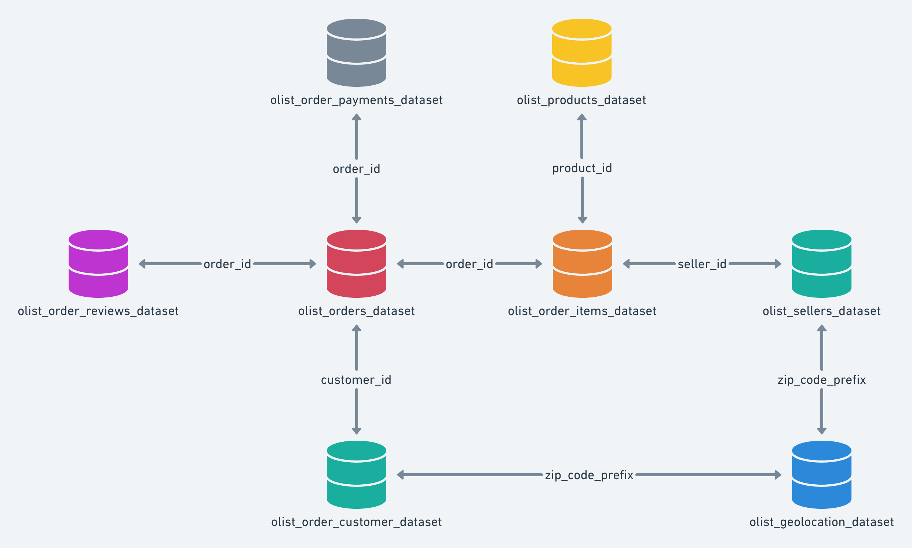

# Case Técnico Dadosfera: Modern Data Platform & AI 🚀

> **Autor:** João Pedro Santos
> **Processo:** Engenharia de Dados - Dadosfera
> **Período:** [12/2025]

## 🎯 Objetivo do Projeto
Este projeto consiste na implementação ponta a ponta de uma Plataforma de Dados para uma empresa de E-commerce Enterprise. O objetivo é demonstrar proficiência em todo o ciclo de vida dos dados, desde a ingestão até a aplicação de IA Generativa e Data Apps, seguindo a filosofia de **Data Lakehouse**.

O projeto simula a migração e modernização da arquitetura de dados de um grande e-commerce, focando em:
- Centralização de dados (Single Source of Truth).
- Enriquecimento de dados com **GenAI** (LLMs).
- Governança e Qualidade de Dados.
- Democratização do acesso via Data Apps.

---

## 🏗️ Arquitetura e Estratégia "Hybrid-First"

Devido à natureza crítica do projeto e para garantir a entrega contínua independente de liberações de acesso, adotei uma **Arquitetura Híbrida/Agnóstica**. 

O desenvolvimento segue o padrão de **Shadow IT Controlada**:
1.  **Core Development:** Realizado em ambiente **Google Cloud Platform (GCP)** e local (Python/Docker), garantindo robustez e portabilidade.
2.  **Integration:** Os ativos gerados são migrados e catalogados na plataforma **Dadosfera**, comprovando a capacidade de interoperabilidade e uso da ferramenta.

### Tech Stack
* **Ingestão & Lake:** Python, Google Cloud Storage (GCS), BigQuery.
* **Transformação & Qualidade:** SQL, Python, Great Expectations.
* **Inteligência (GenAI):** OpenAI API (GPT-4o), LangChain.
* **Visualização:** Power BI (Bônus), Streamlit, Metabase (Dadosfera).
* **Orquestração:** [Definir: Airflow/Scripts Customizados/Dadosfera Pipelines].

---

## 🗂️ Gestão do Projeto (Agile)

O acompanhamento das tarefas, desde a concepção até o deploy, é realizado através de metodologia ágil (Kanban).

* 📊 [**Acesse o Quadro do Projeto**](https://trello.com/b/7aWCHtbz/dadosfera)

### 💰 Estimativa de Esforço e Custos (Story Points)

Para cumprir o requisito de **Estimativa de Custos e Alocação de Recursos** (Item 0 - Avançado), este projeto adota o sistema de pontuação baseado na sequência de Fibonacci adaptada.

---

## 💾 Sobre os Dados (Decisão de Design)

Para atender aos requisitos de volumetria (>100k registros), complexidade relacional e presença de dados desestruturados para NLP, a base escolhida foi:

**Dataset:** [Brazilian E-Commerce Public Dataset by Olist](https://www.kaggle.com/datasets/olistbr/brazilian-ecommerce)

* **Justificativa:** Diferente de bases sintéticas simples, este dataset apresenta um esquema *Snowflake* real, contendo tabelas de pedidos, pagamentos, geolocalização e, crucialmente, **reviews de clientes em texto livre**, permitindo a aplicação de casos de uso reais de GenAI (Análise de Sentimento e Extração de Features).

## 🗺️ Mapeamento de Origem e Arquitetura

### Estratégia de Dados Distribuída (Simulação Real)
Para demonstrar proficiência em engenharia de dados em cenários corporativos heterogêneos, este projeto evita a ingestão monolítica. A arquitetura foi desenhada para consumir dados de múltiplas fontes lógicas, simulando um ecossistema de Data Mesh:

| Fonte Lógica | Tipo de Dado | Implementação Técnica | Contexto de Negócio |
| :--- | :--- | :--- | :--- |
| **ERP Core** | Estruturado | **CSVs (Olist)** | Dados transacionais "frios" de pedidos, itens e clientes (Legado). |
| **App Logs** | Semi-estruturado | **JSON (BigQuery)** | Dados de *Reviews* e avaliações gerados via App, com esquema flexível. |
| **Reference DB** | Banco Relacional | **PostgreSQL (Neon Serverless)** | Dados auxiliares de tradução de categorias (Tabela de Domínio). |
| **Market API** | External API | **REST API (AwesomeAPI)** | Enriquecimento com cotação do Dólar para análises financeiras. |

---

### Arquitetura de Dados de Origem (AS-IS)
O núcleo transacional do e-commerce opera sobre um modelo relacional altamente normalizado, otimizado para a integridade de escrita (OLTP), conforme o diagrama abaixo:

*Figura 1: Entity Relationship Diagram (ERD) do sistema transacional de origem.*

**O Desafio de Engenharia:**
Este esquema, embora eficiente para o software operacional, impõe alto custo computacional e complexidade para análises de BI devido à necessidade de múltiplos JOINS (Esquema Snowflake).
O objetivo deste case (**Item 6**) será transformar este esquema em um modelo **OLAP Dimensional (Star Schema)**, otimizado para leitura e performance em Data Warehousing.

---

## ⚠️ Matriz de Riscos e Decisões

Mantemos uma gestão de riscos viva para antecipar bloqueios técnicos e de negócio.

| Risco Mapeado | Impacto | Estratégia de Mitigação |
| :--- | :--- | :--- |
| **Dependência de Acesso (Plataforma)** | Alto (Bloqueio) | **Decisão:** Iniciar desenvolvimento em GCP (Shadow Env) para garantir cumprimento do prazo e depois migrar. |

